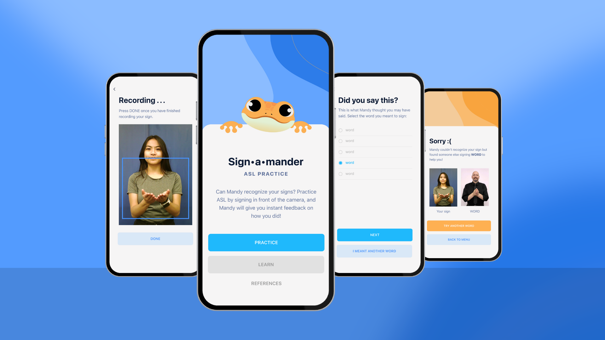

# Sign&#183;a&#183;mander

This is a mobile application built on React Native for my Undergraduate Honors Thesis Research Project, *Sign-a-mander: A Mobile App That Enhances ASL Learning with Computer Vision*. This project investigates Dongxu Li et al.'s I3D sign language recognition model and whether implementing it in a mobile application is feasible. 

### Links:
- [Read my research paper](https://digitalcommons.andrews.edu/cgi/viewcontent.cgi?article=1277&context=honors) 
- [Video demo of the mobile app so far](https://drive.google.com/file/d/1EyIwe2gwZ9dp2kES_Tdl19bG3JTf5Vj1/view?usp=sharing)
- [Sign language recognition model on Github](https://github.com/sandrineadap/WLASLR-cloned) (forked from Dongxu Li et al.'s WLASL repository)

Below is a mockup diagram of my design for the application. I highlight the main design choices on pages 7 and 8 of my research paper linked above. You may also download a PDF version of the diagram by clicking the download button on [this page](./public/Sign-a-mander_mockup.pdf).

